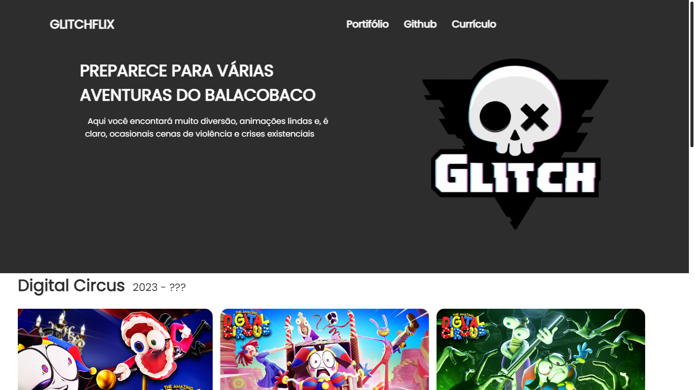
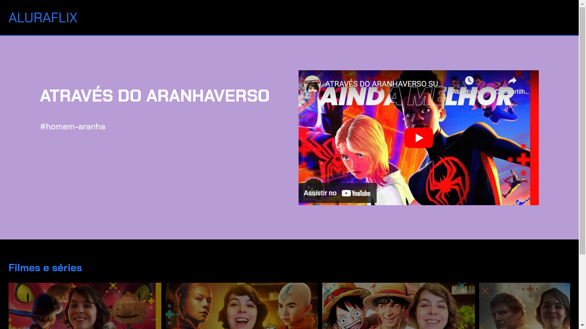

# GLITCHLFIX
Um projeto do alura start para o quarto bimestre. A ideaia era fazer uma "coleção de video" com html e css. Mas quis adicionar o javascript para tornar o código mais simples e limpo.

## COMPARAÇÃO
Meu projeto

Projeto da alura
