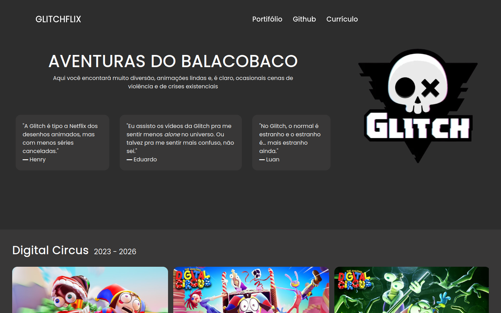
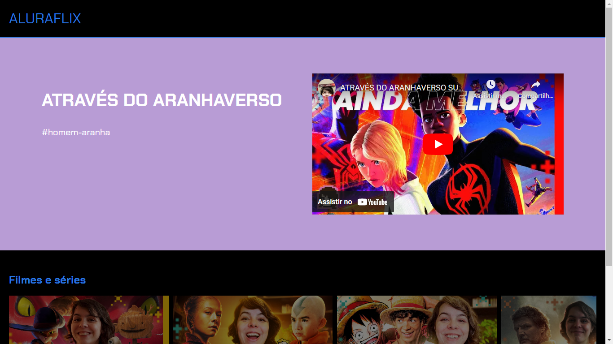

# GLITCHFLIX

Um projeto desenvolvido para o Alura Start no 4º bimestre.

A proposta original da Alura era criar uma "coleção de vídeos" utilizando apenas HTML e CSS. No entanto, achei a estrutura simples, então adicionei JavaScript para tornar o código mais dinâmico, limpo e fácil de manter.

---

## Comparação entre os projeto

Meu projeto

Projeto da alura

---

## Melhorias

### 1. Manutenibilidade

#### Problema
O projeto original não possuía um banco de dados para os carrosséis; em vez disso, todo o conteúdo ficava diretamente no HTML.

Isso gerava problemas de manutenção, pois:
* Exigia alterar o HTML manualmente a cada atualização;
* Abria margem para erros humanos (ex.: uma thumbnail divergente do vídeo configurado);
* Aumentava o trabalho repetitivo desnecessariamente.

#### Solução
Como o foco do projeto era o desenvolvimento web vanilla, sem o uso do Node.js, optei por criar uma variável de dados em JavaScript para armazenar as informações necessárias para popular os carrosséis.

Com isso:
* **Manutenção centralizada:** Basta alterar uma variável no JavaScript;
* **Padronização:** A geração via código garante que os links e thumbnails sigam a mesma estrutura, eliminando inconsistências;
* **Simplicidade:** O único trabalho necessário para adicionar um novo conteúdo é inserir o ID do vídeo na variável de dados de dados.

---

### 2. Continuidade de Navegação

#### Problema
A proposta original exigia que o usuário saísse do site e fosse para uma plataforma externa (como o YouTube) para assistir aos vídeos. Tornando a experiência do usuário inconveniente.

#### Solução
A melhor abordagem era manter o usuário na aplicação exibindo o conteúdo via *pop-up*.

Essa decisão foi tomada porque:
* Respeita os direitos autorais, utilizando o player oficial incorporado do YouTube (*embed*);
* Garante uma boa expêriencia ao usuário.

##### Desafio de Reutilização
Para evitar a duplicidade de código HTML, já que seria necessário ter um HTML de *pop-up* inteiro para cada vídeo, criei uma classe em JavaScript responsável por gerenciar a estrutura HTML de apenas um *pop-up*. 

Assim basta atualizar alguns valores para se ter qualquer *pop-up* necessário, no caso, o ID do vídeo.

##### Desafio de Reutilização
Para evitar a duplicidade de código HTML, já que seria necessário ter um HTML de *pop-up* inteiro para cada vídeo, criei uma classe em JavaScript responsável por gerenciar a estrutura HTML de apenas um *pop-up*. 

Assim basta atualizar alguns valores para se ter qualquer *pop-up* necessário, no caso, o ID do vídeo.

### 3. Responsividade

#### Problema
O projeto proposto não era responsivo, logo era inviável em aplicativos movéis (mais da metade da internet).

#### Solução
Preferir valores dinâmicos (como porcentagens e lagura de tela) no CSS e regras (como o @media) para situações mais drásticas.
